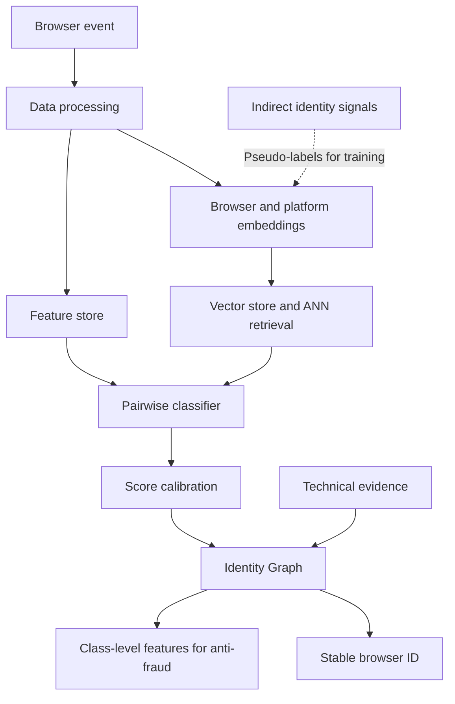

# Browser Fingerprinting and Identity Resolution

*Commercial project, 2025-2026 | Role: sole data scientist*

*Source code and client data are proprietary.*

The project had two related goals. The first was to identify whether an incoming event belonged to a known or a new browser and assign it a stable browser ID. The second was to maintain a rich graph representation of observed browser classes, from which aggregated features could later be produced for an anti-fraud system. Each event contained around 75 heterogeneous browser signals whose values and availability could change across platforms, browser versions, and time.

The work covered the design of the complete ML system: configurable data processing, metric-learning neural networks for browser and platform embeddings, a vector store with ANN candidate retrieval, a feature store, a pairwise CatBoost classifier, score calibration, and an Identity Graph.

The Identity Graph combined model similarity with stronger technical evidence, maintained browser classes over time, isolated ambiguous cases, and allowed earlier decisions to be corrected when new evidence appeared.

Reliable ground-truth labels were not available. Several weak-labelling approaches were therefore developed using indirect identity signals, including login, cookie, and local-storage information. Noisier pseudo-labels were used to bootstrap representation learning, while higher-confidence subsets were selected for model evaluation.

The work included the research implementation of the data-science core, the specification of the production architecture and decision logic, and requirements for monitoring data quality, model performance, and graph health. The production fingerprinting component, partly based on the research code, was integrated for the first client.

Performance depended strongly on the availability of reliable technical evidence and was therefore evaluated separately for different conditions. In a sequential offline evaluation of the pairwise model without direct cookie and local-storage matching features, ROC AUC reached 0.986. At the selected thresholds, precision was 97.2%, recall was 86.3%, and 7.1% of events were assigned to an uncertainty zone.

## System architecture

