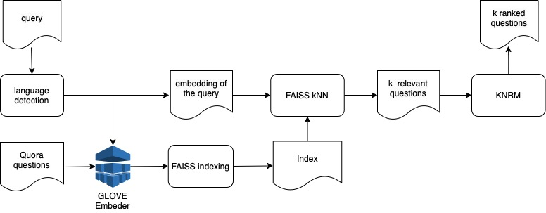
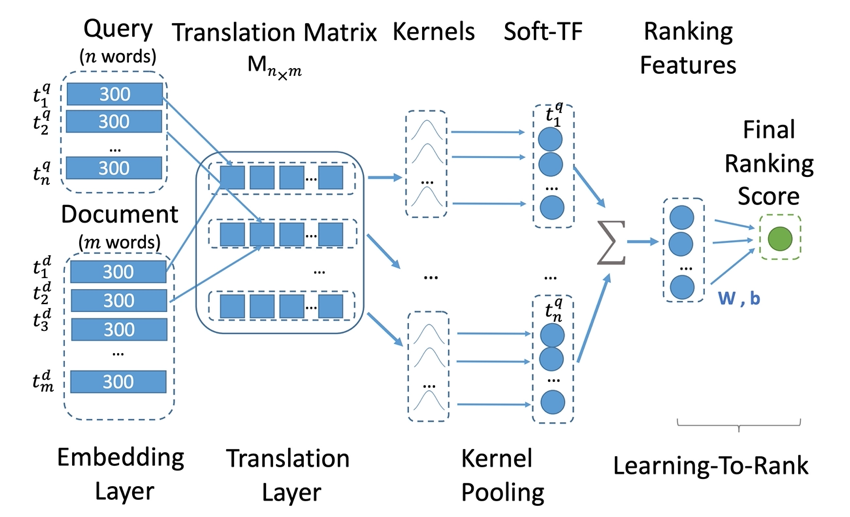

# Neural Ranking and Matching

*Final training project for the Ranking and Matching module of the Hard ML specialisation.*

## Task

Develop a ranking microservice for a question-answering system based on the Quora Question Pairs dataset. Given a query, the service retrieves and ranks the ten most relevant questions.

## Solution

A [Kernel-based Neural Ranking Model (KNRM)](http://www.cs.cmu.edu/~zhuyund/papers/end-end-neural.pdf) is used for the final ranking stage. The model was implemented from scratch as part of the training programme.

## Contents

- [`lib/ranking.py`](./lib/ranking.py): ranking pipeline.
- [`lib/KNRM.py`](./lib/KNRM.py): KNRM implementation.
- [`lib/index.py`](./lib/index.py): FAISS-based candidate retrieval.
- [`notebooks/model_training.ipynb`](./notebooks/model_training.ipynb): model training and evaluation.
- [`solution.py`](./solution.py): Flask service.
