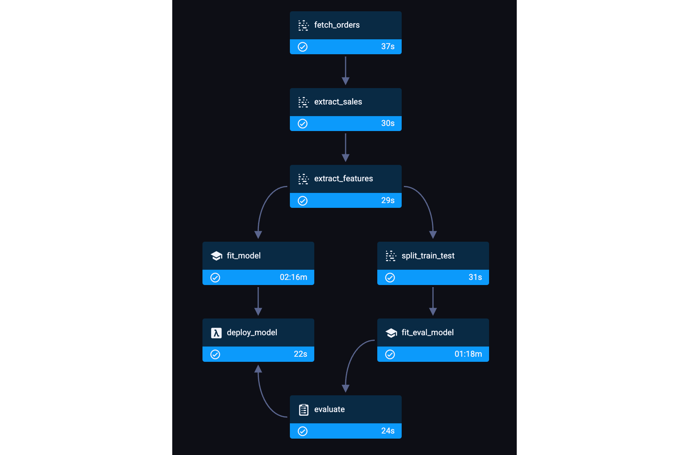

#  ML service for Demand forecasting

#### Content:

- ETL, feature engineering (attributes-aggregation)
- 360 quantile linear regressions
- Week missed profit estimation (confidence interval, bootstrap)
- ClearML based pipelines: training, inference

- FastAPI service
