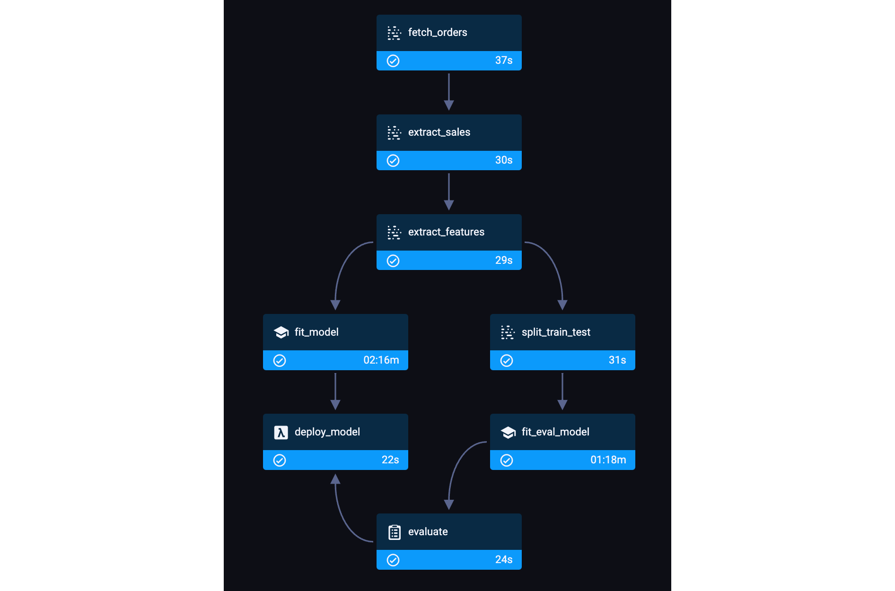

# Demand Forecasting ML Service

A training project covering the main components of a short-term multivariate demand-forecasting service.

## Components

- ETL and feature engineering based on aggregated attributes;
- 360 quantile linear-regression models;
- weekly missed-profit estimation with bootstrap confidence intervals;
- ClearML pipelines for training and inference;
- FastAPI inference service.

