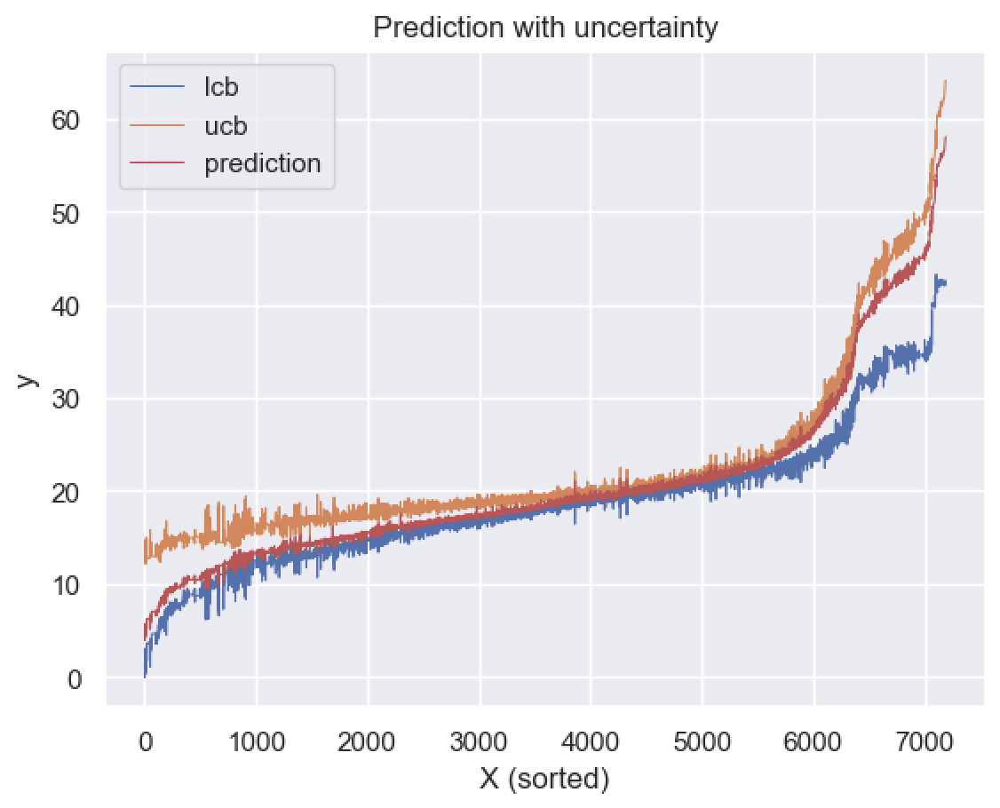

# Boosting uncertainty via ensembles

Implementation of one of the methods discussed in the article: [Uncertainty in Gradient Boosting via Ensembles](https://arxiv.org/pdf/2006.10562v2.pdf)

#### Intuition: 
Each next tree in a boosting model refines the prediction. If some object is easy to predict, the prediction for it will not change much from tree to tree. Conversely, if an object is difficult to predict, the boosting trees will strongly disagree with each other (and the prediction will jump up and down).

Suppose we have a trained boosting. Let us introduce such a notion as a virtual ensemble. Let us take partial prediction at the $i-th$ step (prediction of the first $i$ trees): $i = N/2$ for the first model, $i = N/2 + k$ as the second, $i = N/2 + 2k$ as the third and so on for some $k$ (step). 

The ensemble of such models will be called a virtual ensemble.  Now we can evaluate model uncertainty as the Variance between the predictions of the virtual ensemble models.

#### Content: 

- SQL features request
- Implementation