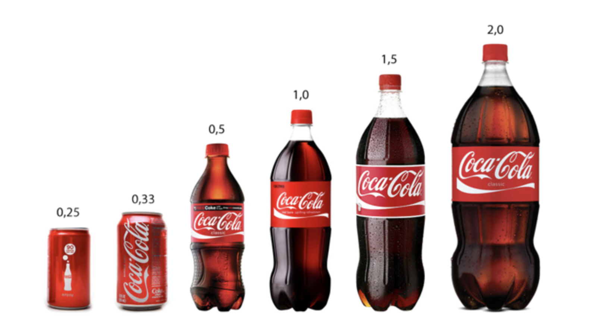

# Dynamic pricing: optimization block

### 1. Target Margin
 

##### Legend:
For each item $i$ price elasticity is estimated in form of optimal price / demand pairs: $\{p_{ij}, d_{ij}\}$:

 
 

##### Problem statement: 

We would like to maximize the total revenue (gmv):

$\sum_i \p_{ij} \cdot d_{ij} \to \max_{J},$

under constraint on the overall weighted margin:

$\sum_i \mu_{ij} \cdot w_{ij} > m$

where 

$J$ - vector of elasticity indices for all items,

$\mu_{ij}$ - item $i$ marginality:

$\mu_{ij} = \dfrac{p_{ij} - c_{i}}{p_{ij}}$

$w_{ij}$ - item $i$ penetration:

$w_{ij} = \dfrac{p_{ij} \cdot d_{ij}}{\sum_i p_{ij} \cdot d_{ij}}$

m - minimal overall weighted margin.
 
##### Solution:

[The problem was also transformed to a mixed-integer linear programming task](./target_margin.py)
 
 
### 2. Optimal price post-processing
 

##### Legend: 

Optimal prices are found using some ML application. The problem is that most products are divided into "horizontal" and "vertical" subgroups, within that certain business constraints or conditions must be meet, eg. all prices in a horizontal group should be equal and for vertical ones the following constraint has to be met

An example of a vertical subgroup is a line of lemonade 'A' bottles 0.25, 0.33, 0.5 liters. An example of a horizontal subgroup is lemonades 'A', 'B', 'C' in 0.33 bottles. A business condition can be the the equality of prices within a horizontal group and strict monotonicity of specific prices within a vertical group:

$\hat{p}_1 / v_1 < \hat{p}_1 / v_2 < ... < \hat{p}_n / v_n,$

where $\hat{p}_i$ are prices, $v_i$ - descending bottle volumes.

 

##### Problem statement: 
The given prices must be optimally (L1) adjusted to satisfy the given constraints.
##### Solution:
[The problem was transformed to a mixed-integer linear programming task](./target_margin.py)

