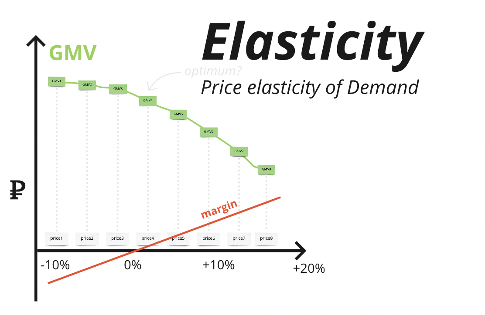

# Dynamic pricing: optimization block

### 1. Optimal price post-processing
 

##### Legend: 

Optimal prices are found automatically with help of some ML app. The problem is that most products are divided into "horizontal" and "vertical" subgroups. An example of a vertical subgroup is the line of lemonade 'A' bottles 0.25, 0.33, 0.5 liters. An example of a horizontal subgroup is lemonades 'A', 'B', 'C' in 0.33 bottles. Prices within subgroups must meet certain business constraints, eg. all prices in a horizontal group should be equal and for vertical ones the following constraint has to be met:

$$p_1 / v_1 < p_1 / v_2 < ... < p_n / v_n,$$ 

where $p$, $v$ are prices and volumes.
##### Problem statement: 
Toe given prices should be optimally (eg. l1) adjusted in order to meet the constraint.
##### Solution:
[The problem was transformed to a mixed-integer linear programming task](./target_margin.py)
 
 

### 2. Target Margin
 

##### Legend:
For each item (sku) $i$ price elasticity is estimated in form of price / demand pairs: $\{p_{ij}, d_{ij}\}$:

 
 

##### Problem statement: 

We would like to maximize the total revenue (gmv): 
$$\sum_i p_{ij} \cdot d_{ij} \to \max_{J},$$
under constraint on the overall weighted margin:
$$\sum_i \mu_{ij} \cdot w_{ij} > m$$ 
where 

$J$ - vector of elasticity indices for all items,

$\mu_{ij}$ - item $i$ marginality,

$$\mu_{ij} = \dfrac{p_{ij} - c_{i}}{p_{ij}}$$

$w_{ij}$ - item $i$ penetration,

$$w_{ij} = \dfrac{p_{ij} \cdot d_{ij}}{\sum_i p_{ij} \cdot d_{ij}}$$

m - minimal overall weighted margin.
 
 
##### Solution:

[The problem was also transformed to a mixed-integer linear programming task](./target_margin.py)