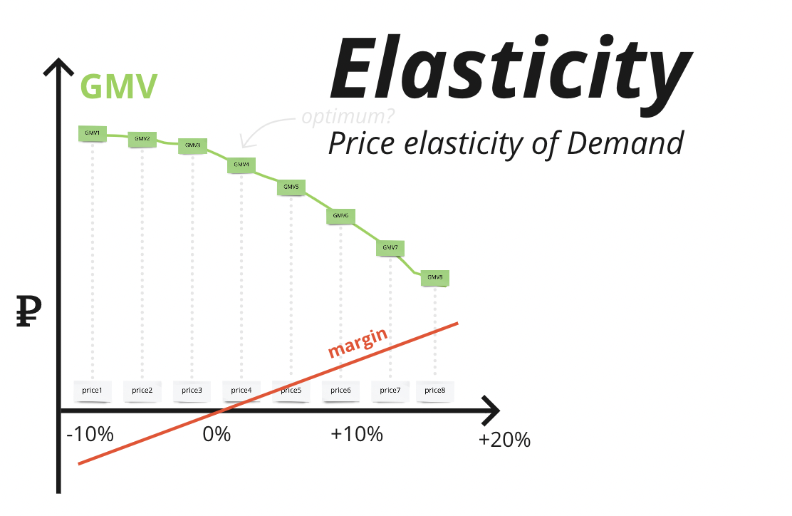
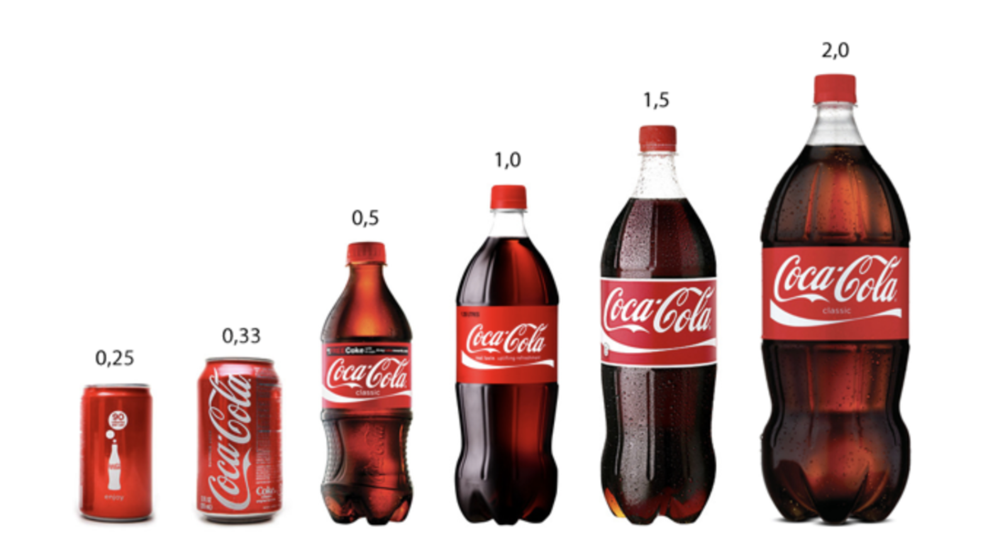

# Dynamic Pricing: Optimisation

## 1. Target margin

For each item $i$, price elasticity is represented by a set of price-demand pairs, $\{p_{ij}, d_{ij}\}$:

The objective is to maximise total gross merchandise value (GMV):

$$\sum_i p_{ij} \cdot d_{ij} \to \max_{J}$$

subject to a minimum weighted-margin constraint:

$$\sum_i \mu_{ij} \cdot w_{ij} > m$$

where:

- $J$ is the vector of selected elasticity indices for all items;
- $\mu_{ij} = \dfrac{p_{ij} - c_i}{p_{ij}}$ is the margin rate for item $i$;
- $w_{ij} = \dfrac{p_{ij} \cdot d_{ij}}{\sum_i p_{ij} \cdot d_{ij}}$ is item $i$'s share of GMV;
- $m$ is the minimum overall weighted margin.

The problem is formulated as a [mixed-integer linear programme](./target_margin.py).

## 2. Optimal-price post-processing

Products can belong to horizontal and vertical groups with additional business constraints. For example, prices may need to be equal within a horizontal group, while unit prices within a vertical group must follow a strict order:

$$\hat{p}_1 / v_1 < \hat{p}_2 / v_2 < \ldots < \hat{p}_n / v_n$$

where $\hat{p}_i$ is the adjusted price and $v_i$ is the corresponding product volume.

The task is to find the smallest L1 adjustment to the proposed prices while satisfying all group constraints. It is also formulated as a [mixed-integer linear programme](./price_adjustment.py).
