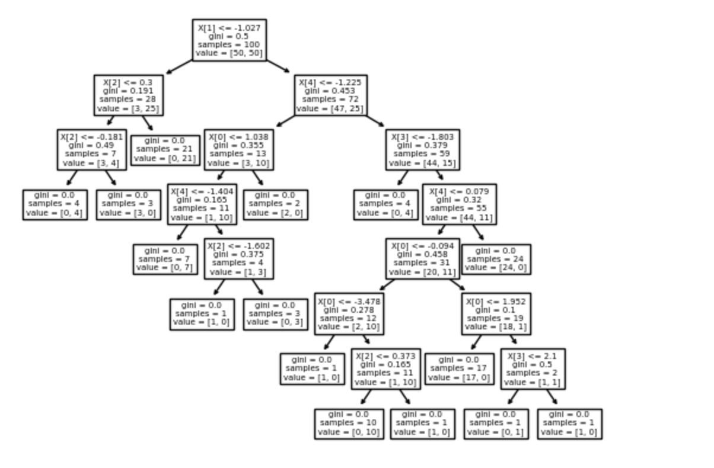

## Decision tree to SQL request

Function, that convert a sklearn decision tree to a SQL code:

##### Example:
```
tree_as_json = convert_tree_to_json(decision_tree_classifier)
generate_sql_query(tree_as_json, features)
```
converts



to

```
SELECT
CASE
  WHEN f_2 > -1.0271 THEN
    CASE
      WHEN f_5 > -1.2255 THEN
        CASE
          WHEN f_4 > -1.8033 THEN
            CASE
              WHEN f_5 > 0.0786 THEN 0
              ELSE
                CASE
                  WHEN f_1 > -0.0939 THEN
                    CASE
                      WHEN f_1 > 1.9515 THEN
                        CASE
                          WHEN f_4 > 2.1003 THEN 0
                          ELSE 1
                        END
                      ELSE 0
                    END
                  ELSE
                    CASE
                      WHEN f_1 > -3.4783 THEN
                        CASE
                          WHEN f_3 > 0.3728 THEN 0
                          ELSE 1
                        END
                      ELSE 0
                    END
                END
            END
          ELSE 1
        END
      ELSE
        CASE
          WHEN f_1 > 1.0377 THEN 0
          ELSE
            CASE
              WHEN f_5 > -1.4044 THEN
                CASE
                  WHEN f_3 > -1.6016 THEN 1
                  ELSE 0
                END
              ELSE 1
            END
        END
    END
  ELSE
    CASE
      WHEN f_3 > 0.2996 THEN 1
      ELSE
        CASE
          WHEN f_3 > -0.1805 THEN 0
          ELSE 1
        END
    END
END AS class_label
```