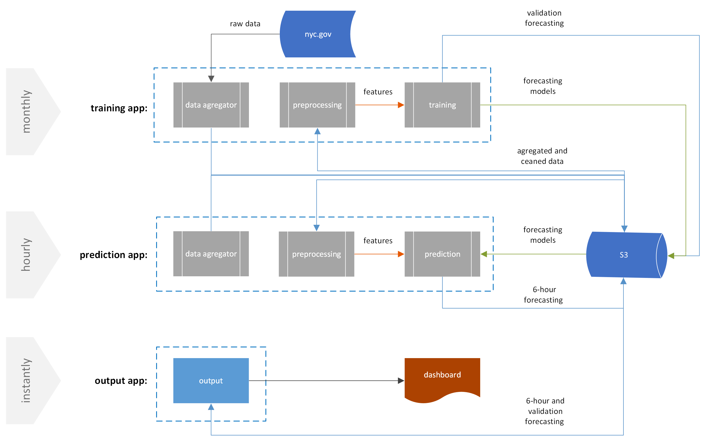

## Application description

The considered toy application is a simulation of real-time short-run forecasting of demand for yellow taxis in the liveliest areas of New York. It is based on [taxi trip records data](https://www.nyc.gov/site/tlc/about/tlc-trip-record-data.page) and consists of three parallel processes, each capable of running at different intervals. The entire process is illustrated in the following diagram:

The core of the application is a multiple forecasting model that simultaneously predicts demand for taxis in over fifty zones of New York. After conducting various experiments (including ARIMA models for time series clusters and different regressors for the current approach), a ridge regression model was chosen (one model for each prediction hour). Despite the model simplicity, advanced feature engineering led to rather good forecasting quality. I employed cross-combined features with 'zone id' / 'hour' as the first component, Fourier harmonics, autoregressive values, and some additional parameters from the data (average duration, cost, distance of a trip, cross features from neighboring zones) for the second. All feature combinations are built on preprocessed data (cleaned and hourly aggregated raw trip data).

The original goal was to model the workflow of a real ML application, so I endeavored to incorporate some "reality" into each of the components. To ensure the model stays up-to-date, the training procedure is repeated monthly using a sliding six-month data interval. The prediction component of the app (forecasting taxi demand for the next six hours) runs hourly, simulating the last hour's data update. The updated prediction values, as well as validation results from the last training, are visualized by the third output component in the form of an interactive dashboard. All data exchange between the processes is conducted through an S3 bucket for simplicity.

The project was deployed with help of Pergola.