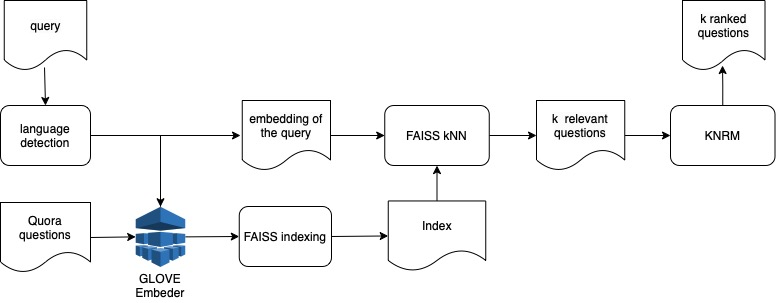
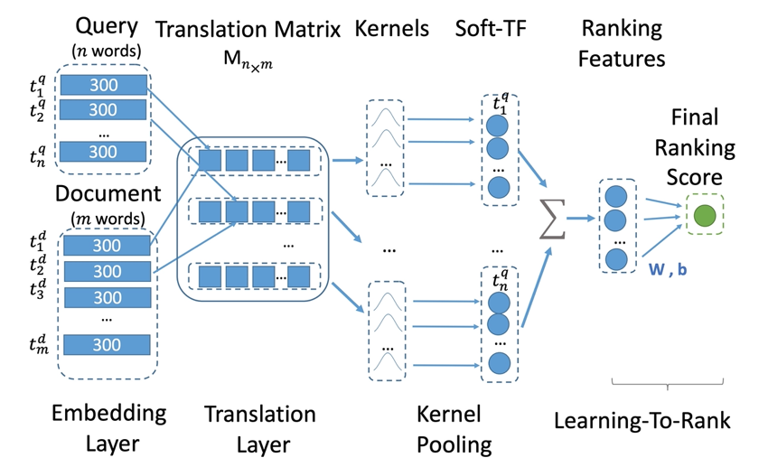

# Final project of Ranking&Matching module of Hard ML specialization

## Task
Develop of a ranking microservice for a QA system based on the [Quora Question Pairs](https://paperswithcode.com/dataset/quora-question-pairs) dataset. The service should select the top 10 questions most relevant to a query (question).

## Solution
##### Project diagram: 

[KNRM (Kernel Neural Ranking Model)](http://www.cs.cmu.edu/~zhuyund/papers/end-end-neural.pdf) was used as a ranking model, it was implemented from scratch in one of the homework assignments.
##### KNRM diagram: 

## Content
- [ranking/lib/ranking.py](./lib/ranking.py) - model implementation 
- [/lib/KNRM.py](./lib/KNRM.py) - KNRM algorithm
- [/lib/index.py](./lib/index.py) - FAISS kNN
- [model_training.ipynb](./notebooks/model_training.ipynb) - model training & testing
- [solution.py](./solution.py) - flask service 

